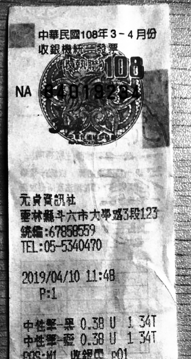
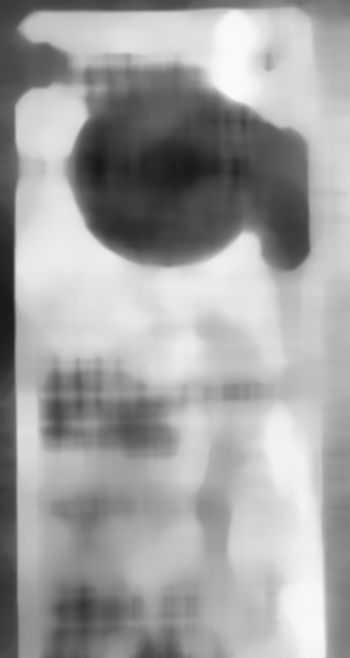
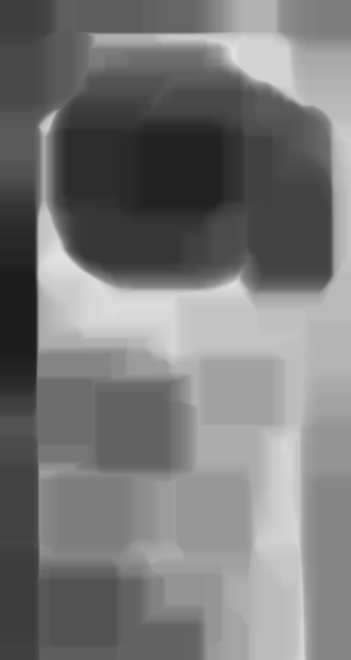
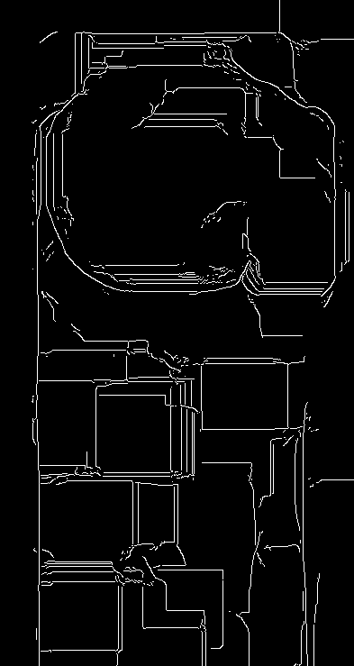
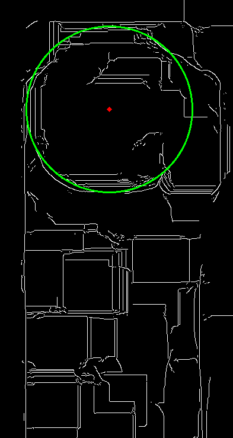
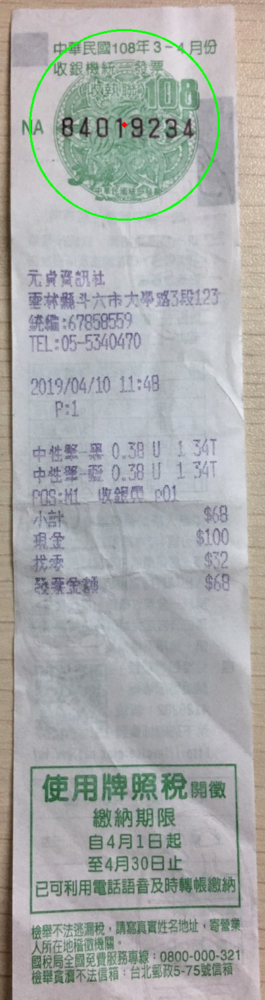

# 影像辨識破專題 發票辨識

* [houghcircle.py](./houghcircle.py): 透過HoughCircle找到圓的所在位置

## Hough Circle Transform 步驟

| 1 | 2 | 3 | 4 | 5 | 6 |
|---|---|---|---|---|---|
|||||||

1. Equalization 直方圖等化
2. GaussianBlur/MedianBlur 高斯濾波和中值濾波去除非必要的雜訊
3. Dilate/Erode 侵蝕和膨脹，嘗試去除文字雜訊
4. Canny 邊緣偵測
5. Hough Circle Transform 找到近似圓的浮水印位置
6. Done

